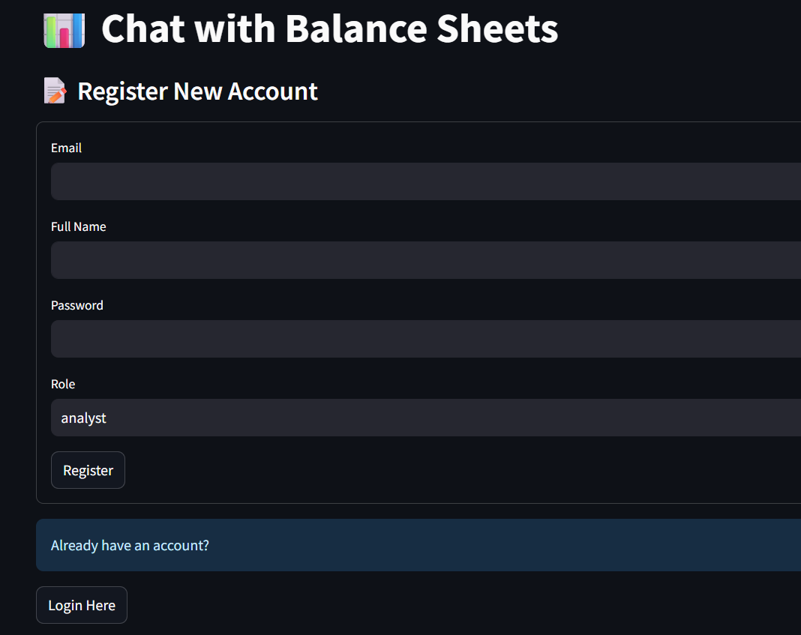

# 📊 BalanceAI – Chat with Company Balance Sheets using AI

**BalanceAI** is an intelligent assistant that enables analysts and top management to upload and interact with company balance sheets using natural language. It extracts structured financial data from PDFs and allows you to ask questions powered by a Retrieval-Augmented Generation (RAG) system using LLaMA via the Groq API.

---

## 🚀 Features

-   **Secure Authentication**: Register and log in with JWT-based, role-specific access.
-   **PDF Analysis**: Upload balance sheet PDFs for intelligent data extraction.
-   **Interactive Chat**: Ask complex questions in natural language to get instant insights.
-   **RAG Pipeline**: Utilizes a powerful RAG system for accurate, context-aware answers.
-   **Role-Based Access Control**:
    -   **Analyst**: Can upload documents and perform analysis.
    -   **Top Management**: Can view data for their assigned company.
    -   **Group Head**: Has a global view across all companies.

---

## 🧱 Tech Stack

| Layer               | Technology                                |
| ------------------- | ----------------------------------------- |
| **Backend API** | FastAPI                                   |
| **Authentication** | JWT, OAuth2                               |
| **Database** | MongoDB (with Motor for async operations) |
| **PDF Extraction** | `pdfplumber`                              |
| **Embedding Model** | `sentence-transformers` (all-MiniLM-L6-v2)  |
| **Vector Store** | FAISS (Facebook AI Similarity Search)     |
| **LLM Provider** | Groq API (LLaMA-3-70B)                    |
| **Frontend** | Streamlit                                 |

---

## ✅ Setup Instructions

### 1. Clone the Repository

```bash
git clone https://github.com/SamarthKumbar/FinBot.git
cd balanceai

```

### 2. Backend Setup
```
First, set up and run the FastAPI backend server.

Navigate to Backend Directory & Create Virtual Environment

cd backend
python -m venv venv

# On macOS/Linux
source venv/bin/activate
# On Windows
.\venv\Scripts\activate

Install Dependencies
pip install -r requirements.txt

Configure Environment Variables
Create a file named .env inside the backend/ folder and add the following:

MONGO_URI="your_mongodb_connection_string"
SECRET_KEY="a_very_strong_and_secret_key_for_jwt"
ALGORITHM="HS256"
ACCESS_TOKEN_EXPIRE_MINUTES=60
GROQ_API_KEY="your_groq_api_key_here"

Run the Backend Server
uvicorn main:app --reload
The API documentation will be live at http://127.0.0.1:8000/docs

```

### 3. Frontend Setup
```
Open a new terminal for the Streamlit frontend.

Navigate to Frontend Directory
cd ../frontend

Run the Streamlit App
streamlit run app.py

```


🧪 Usage Flow
```
Register a new user account with an appropriate role (e.g., "analyst").

Login to authenticate and receive your session token.

Upload a balance sheet PDF using the sidebar navigation.

Chat with the document by asking questions like:

"What was the net profit in Q1 2025?"

"Has revenue shown growth over time?"

"Compare total assets and total liabilities for the last period."

```


How RAG Works Here

```
The application leverages a RAG pipeline to provide accurate answers:

PDF Parsing: Raw text is extracted from the uploaded PDF using pdfplumber.

Chunking: The long text is split into smaller, semantically meaningful chunks.

Embedding: Text chunks are converted into numerical vectors using the all-MiniLM-L6-v2 model.

Indexing: The embeddings are stored in a FAISS vector index for fast retrieval.

Querying: When a user asks a question, the system retrieves the most relevant chunks from the index.

LLM Prompting: The retrieved context and the user's question are sent to the LLaMA-3 model via the Groq API to generate a final, coherent answer.

```




